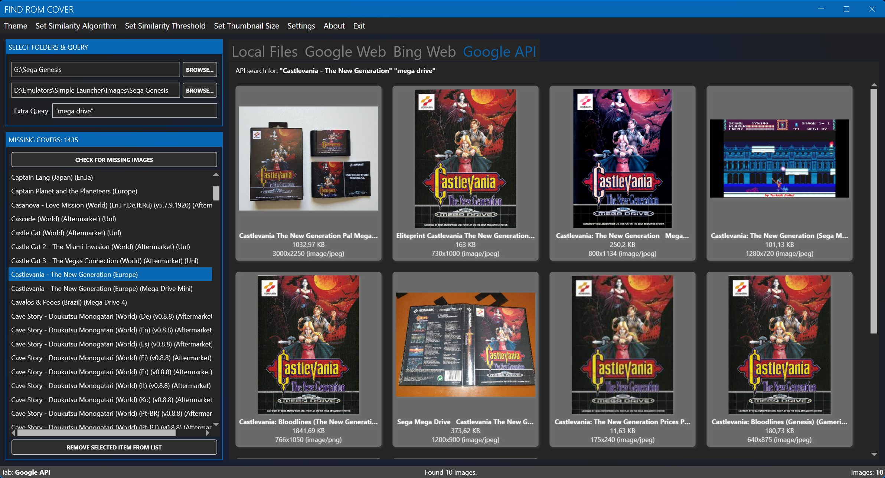

# Quick Start

This walkthrough takes you from a fresh installation to your first saved cover in about five minutes.

## 1. Set your folders

1. Start FindRomCover.
2. Next to **ROM Folder**, click **Browse...** and select the folder that contains your game files.
3. Next to **Image Folder**, click **Browse...** and select the folder where covers are stored.
4. As soon as both folders are set, the scan runs automatically. You can re-run it at any time with **Check for Missing Images** or **F5**.

The status bar reports how many ROM files matched the supported extensions and how many are missing covers.

## 2. Pick a missing game

The **Missing Covers** list shows every ROM that has no matching cover image. Select an entry to search for it. The selected filename is copied to the clipboard automatically, which makes manual web searches easier.

> **Tip:** Right-click an entry to remove it from the list, copy the filename, or delete the corresponding ROM/ISO file from disk.

## 3. Find a cover

Use the tabs above the results area:

| Tab | What it does |
|-----|--------------|
| **Local Files** | Ranks images in your image folder by filename similarity using the selected algorithm and threshold |
| **Google Web** | Opens a Google image search in an embedded browser |
| **Bing Web** | Opens a Bing image search in an embedded browser |
| **Google API** | Shows Google Custom Search results as thumbnails (requires an API key) |

Adjust the search with the **Extra Query** box, for example `box art` or `front cover`.

## 4. Save the cover

- **Local Files / Google API**: click the image you want. It is converted to PNG if necessary and saved as `[gamename].png` in your image folder.
- **Google Web / Bing Web**: right-click the image in the embedded browser and choose **Save image as...**. Save it anywhere inside your image folder using any filename — FindRomCover detects the new file, renames it to the selected game, converts it to PNG, and removes the game from the missing list automatically.

The game disappears from the missing list once the cover is in place.

## 5. Optional: let AI pick for you

1. Open `Settings > AI Settings...`.
2. Choose a provider, paste an API key, and click **Test / Load Models** to verify the connection.
3. Enable **AI-assisted image selection**.
4. Back in the main window, use **AI Pick Best** on the Local Files or Google API tab, or **AI Fill Missing Covers...** to process the whole list.

The default OpenRouter model is `qwen/qwen3.7-flash`, one of the cheapest vision-capable models available. See [AI Vision Assist](../ai/index.md) and [Recommended Models](../ai/recommended-models.md) for details.

## Where to go next

- [Interface Overview](../user-guide/interface.md)
- [Local Files Search](../user-guide/local-files.md)
- [Image Handling](../user-guide/image-handling.md)
- [AI Vision Assist](../ai/index.md)
- [Troubleshooting](../troubleshooting.md)
