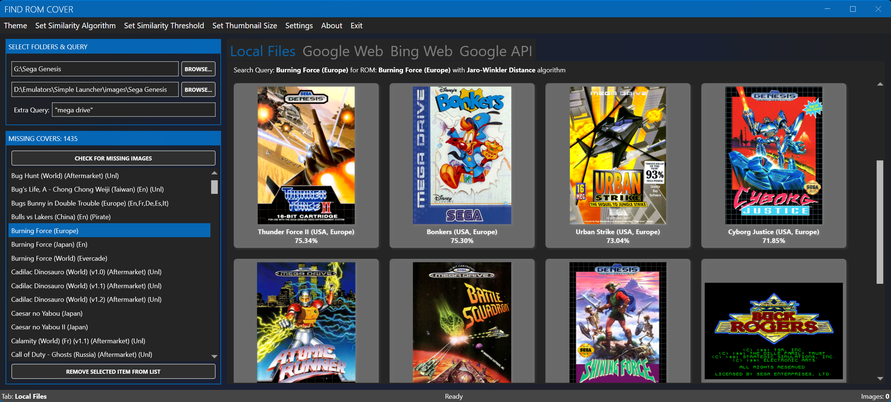

# Interface Overview

The FindRomCover main window is organized around four areas: the menu bar, the folder and query panel, the missing covers list, and the search tabs.

## Menu bar

| Menu | Items | Description |
|------|-------|-------------|
| **Theme** | Light, Dark | Switch the base theme |
| **Theme > Accent Colors** | 20+ colors | Red, Green, Blue, Purple, Orange, Lime, Emerald, Teal, Cyan, Cobalt, Indigo, Violet, Pink, Magenta, Crimson, Amber, Yellow, Brown, Olive, Steel, Mauve, Taupe, Sienna |
| **Set Similarity Algorithm** | Jaccard Similarity, Jaro-Winkler Distance, Levenshtein Distance | Algorithm used to match local image filenames to ROMs |
| **Set Similarity Threshold** | 10% – 90% | Minimum similarity required to list a local image |
| **Set Thumbnail Size** | 100 – 500 pixels | Preview size for Google API results |
| **Settings > API Settings...** | — | Google Custom Search API key |
| **Settings > AI Settings...** | — | AI provider, model, limits, and behavior |
| **Settings > Edit Supported Extensions...** | — | Manage which ROM file extensions are scanned |
| **Settings > Show/Hide Log Window** | — | Toggle the live log viewer |
| **Settings > Use MAME Descriptions** | — | Use MAME descriptions instead of cleaned filenames for searches |
| **About** | Donate, About, Exit | Support links and application information |

## Folder and query panel

| Control | Purpose |
|---------|---------|
| **ROM Folder** | Root folder of your ROM collection; scanned for supported extensions |
| **Image Folder** | Folder that holds (and receives) cover images |
| **Extra Query** | Extra words appended to the search query, for example `box art` or `front cover` |
| **Check for Missing Images** | Re-scans both folders and rebuilds the missing list (also **F5**) |

When both folders are valid, the scan starts automatically. The status bar shows how many ROM files were found and how many are missing covers.

## Missing covers list

The list on the left shows every ROM without a cover. Selecting an entry:

- triggers a search with the currently selected tab;
- copies the ROM filename to the clipboard;
- updates the search query (and the MAME description, if enabled).

Right-click context menu:

| Item | Action |
|------|--------|
| Remove Item from the list | Hides the entry without touching any files |
| Copy FileName | Copies the ROM filename to the clipboard |
| Delete corresponding ROM or ISO | Permanently deletes the ROM file from disk after confirmation |

Press **Delete** with an entry selected to remove it from the list.

## Search tabs

| Tab | Result type |
|-----|-------------|
| **Local Files** | Images from your image folder, ranked by filename similarity |
| **Google Web** | Embedded Google image search |
| **Bing Web** | Embedded Bing image search |
| **Google API** | Google Custom Search JSON API results as thumbnails |

Each tab keeps its own results; switching tabs does not discard them. The status bar shows the active tab name.

## Status bar

The status bar reports scan results, active operations, and AI progress. Typical messages:

- `MISSING COVERS: n` — number of games without covers
- `Found n ROM files, n missing covers` — scan summary
- `Screenshot saved: <path>` — after pressing **F8**
- AI progress and result messages while picking or batch filling

## Log window

`Settings > Show/Hide Log Window` opens a live view of the application log with severity, timestamp, and message. It is the fastest way to diagnose problems. Log files are also written to disk — see [Logs & Diagnostics](../configuration/logs.md).

## Keyboard shortcuts

The most important shortcuts are **F5** (rescan), **F8** (screenshot), **Delete** (remove selected missing entry), and **Enter** in the folder boxes (start scanning). See [Keyboard Shortcuts](../reference/keyboard-shortcuts.md) for the full list.

## Related pages

- [Folders & Scanning](folders-and-scanning.md)
- [Local Files Search](local-files.md)
- [Missing Covers List](missing-covers.md)
